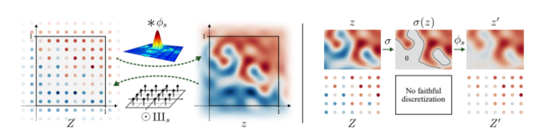
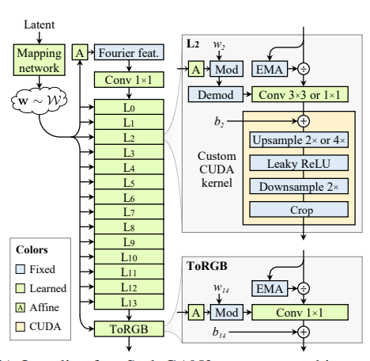

# STYLEGAN 3 : Alias-Free Generative Adversarial Networks
Tero Karras, Miika Aittala ,Samuli Laine , Erik Härkönen, Janne Hellsten, Jaakko Lehtinen, Timo Aila 

## Summary

* The typical GANs depends on absolute pixel coordinates in an unhealthy manner. This manifests itself as, e.g., detail appearing to be glued to image coordinates instead of the surfaces of depicted objects.

* The previous architectures upto StyleGan 2 produced great results for static images but failed in case of dynamic images , videos or when details are moved due to texture sticking and lack of .translational as well as rotational equivariance.

<video width="500px" height="300px" controls="controls">
 <source src="../images/stylegan.mp4" type="video/mp4" /></video>
 
 <video width="500px" height="300px" controls="controls">
 <source src="../images/left_equivariance.mp4" type="video/mp4"></video>

* The root cause was careless signal processing that causes aliasing in the generator network. 

* Interpreting all signals in the network as continuous, we derive generally applicable, small architectural changes that guarantee that unwanted information cannot leak into the hierarchical synthesis process.

* The results pave the way for generative models better suited for video and animation.

## Goal

Our goal is an architecture that exhibits a more natural transformation hierarchy, where the exact sub-pixel position of each feature is exclusively inherited from the underlying coarse features.

## Methodology

Our deep neural network tends to  amplify even the slightest amount of aliasing and combines it over multiple scales allowing it to build a basis for texture motifs that are fixed in screen coordinates.

We need to ensure anti-aliasing and translational equivariance to solve the issue.

### Equivariance via continuous signal interpretation

* According to the Nyquist–Shannon sampling theorem , a regularly sampled signal can represent any continuous signal containing frequencies between zero and half of the sampling rate

* We create a continuous signal z(x) by convolution of a feature map and  Z(x) , the discretely sampled feature map.

$$  z(x) = (φ ∗ Z)(x) $$ 

* Conversion from the continuous to the discrete domain corresponds to sampling the continuous signal z(x) at the sampling points of Z[x] that we define to be offset by half the sample spacing to lie at the “pixel centers”.

* If $ Z^{'} = F(Z)$ then $z^{'} = f(z) = φ∗ F(Z)$

* We now consider the primitive operations in a typical generator network: convolution, upsampling, downsampling, and nonlinearity.

### Convolution: 

$$F_{conv}(z) = K ∗ z$$

Where K is the kernel.

### Upsampling and Downsampling

* Ideal upsampling does not modify the continuous representation.Its only purpose is to increase the output sampling rate  to add headroom in the spectrum where subsequent layers may introduce additional content.

* In downsampling, we must low-pass filter z to remove frequencies above the output bandlimit,
so that the signal can be represented faithfully in the coarser discretization.

* For rotation equivariance we must use a radially symmetric filter with disc-shaped frequency response.

### Nonlinearity 

* Applying a pointwise nonlinearity σ in the discrete domain does not commute with fractional translation or rotation. However, in the continuous domain, any pointwise function commutes trivially with geometric transformations and is thus equivariant to translation and rotation.

The changes are done to only generator part of the stylegan 2 model while no changes are made to discriminator pf the model.

## Practical Application

* We want to make all the layers of synthesis network of StyleGan 2 generator equivariant using above methods to achieve our target.

* To facilitate exact continuous translation and rotation of the input z0, we replace the learned input
constant in StyleGAN2 with Fourier features , which also has the advantage of naturally defining a spatially infinite map. We sample the frequencies uniformly within the circular frequency
band fc = 2.

* Our theory assumes an infinite spatial extent for the feature
maps, which we approximate by maintaining a fixed-size margin around the target canvas, cropping to this extended canvas after each layer. This explicit extension is necessary as border padding is known to leak absolute image coordinates into the internal representations

* A step by step redesign of stylegan 2 architecture is done motivated by continuous interpretation.

## Results 

* The results show that  FID of StyleGAN3 remains competitive with StyleGAN2. StyleGAN3-T and StyleGAN3-R perform equally
well in terms of FID, and both show a very high level of translation equivariance. Only the latter provides rotation equivariance.

## Limitations and Future Work

* In this paper only modifications to generator were made. Improvements in discriminator could be made.

* If the assumptions related to training data are not met , then the model might not work in the desired way. e.g. letterboxing of
training images, low-quality JPEGs, or retro pixel graphics.

* In future noise inputs can be reintroduced.It might be beneficialto try to extend our approach to equivariance w.r.t. scaling, anisotropic scaling, or even arbitrary homeomorphisms.

## Our Two Cents 

StyleGAN3 proposes an interesting way to deal with aliasing by making the signals continuous and paves way for generative AI into the field of animations and videography.

## Resources 

[Github Repo for StyleGAN3](https://github.com/NVlabs/stylegan3)

[StyleGAN3 Paper](https://arxiv.org/abs/2106.12423)
 

