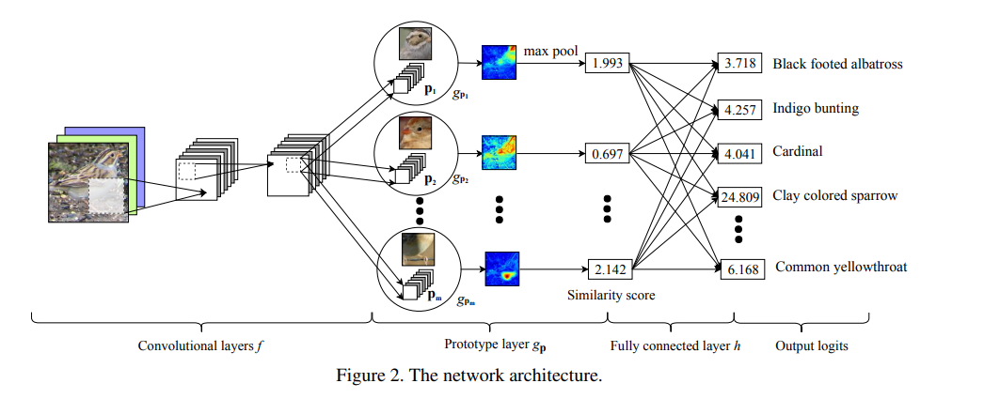
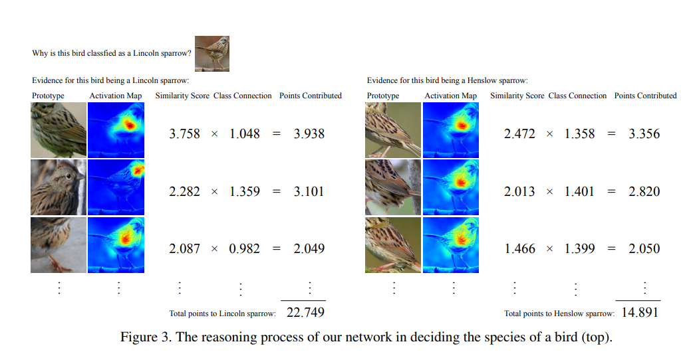

# This Looks Like That: Deep Learning for Interpretable Image Recognition
Chaofan Chen, Oscar Li, Chaofan Tao, Alina Jade Barnett, Jonathan Su, Cynthia Rudin

## Summary
This paper proposes a novel idea for interpretable deep learning , it basically figures out some protopyical parts of images by itself , and then uses these prototypes to make classification , hence making the classification process interpretable.
**Among the top 3% accepted papers of NIPS 2019**

## Architecture Details
- Intially we have the first 13 layers of the  VGG-16 network ,followed by 2 , 1x1 convs
- The network learns m **prototypes** (pj) , with a predefined number of prototypes for each class .
- Each prototpye is applied to all the patches of the conv output , and using the L2 distance , a **similarity score is produced for a single prototype for all the patches** , this can also be used to make a heatmap of similarity .
- Then global pooling is applied to convert this into a single score **gpj**.Which represents the strongest similar finding of that prototype in the image.
- Then the m global similarity scores are feeded in the FC layer to perform classification.

## Overview
- The network basically learns from the training set, a limited number of **prototypical parts** that are useful in classifying a new image.
- The model is able to identify several parts of the image where it thinks that this identified part of the image looks like that prototypical part of some training image, and makes its prediction based on a weighted combination of the **similarity scores** between parts of the image and the learned prototypes.

- There are 3 training stages  
    1. **SGD of the layers before the FC layer h** -  This aims to learn a meaningful latent space where the most important            patches for classifying images are clustered around prototypes associated with their own classes (Clustering Cost), and those important patches from different classes will be separated into distinct clusters(Separation Cost) . The loss function is sum of the cross entropy loss , the clustering cost and the seperation cost .
    
    2. **Projection of the prototypes onto the closest latent representations of training image patches from the same class as       that of the prototype.** -  We push each prototype pj onto the closest latent representation of training image patches from the same class as that of pj . So effectively each prototype now corresponds to some patch of a image in the training set
    3. **Convex optimization of the last layer h. (Using Adam)** - The parametets of the conv , and the prototype layers are fixed . Also the weights of the last layer are encouraged to be sparse by adding L1 regularisation.
    
    

- The nearest prototypes of a given image are mostly prototypes associated with the class of the image
- The nearest patches of a given prototype mostly come from those images in the same class as that of the prototype
- Similar parts are consistently highlighted when the original images containing the nearest patches of a given prototype are passed through the network to generate the activation maps.

## Strengths
- The classification process is very interpretable , as we can see which prototype got the maximum similarity and also we can make an activation map to identify which part of the image was repsonsible for classification.
- In more high stakes decisions like detecting breast cancer this interpretability is very important , as we need to know examine the process by which the network classifies.
- The network can achieve comparable accuracy with its analogous standard non-interpretable counterpart as well as other interpretable deep models.

## Weaknesses
- There are sometimes same prototypes , which indicates a lack of representational power.
- Sometimes similar prototypes of other classes also have high similarity scores , leading to wrong classification.

## Implementation
- Work in progress (as a part of the NeurIPS 2019 Reproduciblity Challenge)

