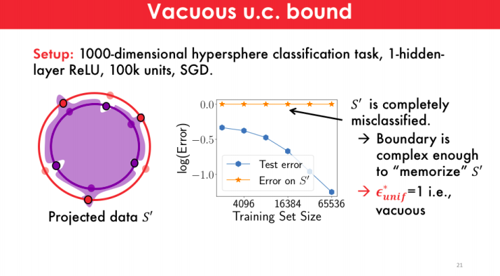

# Uniform convergence may be unable to explain generalization in deep learning
Vaishnavh Nagarajan, J. Zico Kolter

## Summary
This paper proposes an argument against the use of uniform convergence based generalization bounds to explain why overparameterized deep networks generalize well. , they do so by failing the tightest (algorithm, distribution)-dependent uniform convergence bound.

## Background Information about the problem

 - The author first reviews how the standard uniform convergence based bounds works 
 - Classical uniform convergence based approaches bound Test error by `test error <= Train error + O(some complexity term)/sqrt(training set size))` which fails in the over parameterized setting due to the complexity overshooting.
 - In the modern approach, it is tried to find weights which are implicitly regularised when trained on real data and then apply uniform convergence on them (simpler, norm bounded class of functions) to yield better bounds

## Main Experiment

- They took two uniform hypersphere distributions in 1000 dimensions which are very close 
- The task was to separate these two hyperspheres, then they trained a 1 hidden layer wide neural network using SGD on this dataset.
- It was observed that as the training dataset size increases ...the test error decreases or generalization increases.
- But now comes the main catch, they now project each h training point onto its opposite hypersphere and flip its label, they then try to classify this ...and the network misclassifies all of these projected data points.
- So the error on this new dataset is high, even though the error on random test inputs is small.
- Intuitively, the misclassification of this new data means that the learned decision boundary near each training datapoint is skewed into the opposite class, resulting in the closest point from the opposite class to be misclassified. 
- The skewing around datapoints also means that the learned decision boundary is “complex” enough to “memorize” the locations of the training data (although at the same time, the decision boundary generalizes well).

## Main Contributions

- The author suggested that the modern approaches for bounds either still depend on the parameter count to a large extent or if not, they hold only on a modified network, which has gone through different kinds of explicit post-processing.
 
- They observe that as we increase the dataset size, the test error decreases with the training set size, as expected. On the other hand, the bounds increase with dataset size, this increase even though the denominator in these generalization bounds already has a training set size is because of the weight norms of the network increase significantly with the dataset size.

- In other words, they emphasize that we must also worry about training-data-size dependence of these generalization bounds to fully explain generalization in deep learning and not only focus on the parameter count dependence.

- They also supposedly disprove uniform convergence in its best-case scenario ...ie.....via the hemisphere experiment, they give multiple mathematical theorems and proofs for it.

- So the main takeaway here is that overparameterized models trained by gradient descent can have certain complexities in their boundaries, and these complexities can hurt uniform convergence, without hurting generalization

## Our Two Cents

- The experiment proposed in this paper is very simple but also quite thought-provoking ....a rare feature in the deep learning world.
- This paper proposes the need to think about new methods to explain generalization in deep neural networks and thus is highly research encouraging.

## References and Further reads
- https://locuslab.github.io/2019-07-09-uniform-convergence
- http://www.cs.cmu.edu/~vaishnan/talks/icml19_ws_uc_slides.pdf
