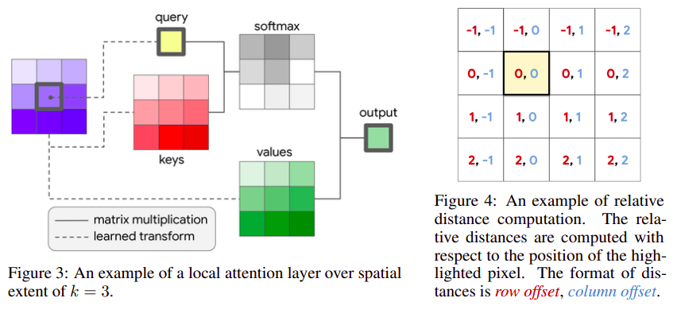

# Stand-Alone Self-Attention in Vision Models

Prajit Ramachandran, Niki Parmar, Ashish Vaswani, Irwan Bello, Anselm Levskaya, Jonathon Shlens

## Summary

This paper proposes a method to entirely remove convolutions by pure self attention based vision models

## Main contribution

- CNN's have problem in capturing long range interactions because they don't scale well with large receptive fields.

- Attention usally allows us to deal with such long range interactions, this paper basically provides a way to develop a purely self-attention based vision model.

- Previous works used global attention, ie. attention between all the pixels, which required considerable downsampling due to computational overhead. This paper works on local attention ie. attention applied to a small neighbourhood around the pixel.

- Instead of the sinusoidal positional embeddings as in transformer they use a concept of relative attention which leads to a translational equivariance same as convolutions.

- The paper suggests that its better to use convs in earlier layers that they called `stem`,as in the early layers content is comprised of RGB pixels that are individually uninformative and heavily spatially correlated. This property makes learning useful features such as edge detectors difficult for content-based mechanisms such as self-attention.

- Convolutions may better capture low level features while attention layers better capture global information.

## Methodology

- Self attention is similar to transformer, consisting of key,value,query pairs. Query of a pixel is dot-producted with keys of all local pixels, and softmax is applied to get weights, which are used to find a weighted sum of the values to get the output. The input pixel feature is of `din` dimension which is transformed to `dout` for each of key,value and queries, using different linear transformations.

- They also perform multi-head attention by dividing the input pixel features of size (din) into equal parts depthwise (din/n) and then applying attention to all of them individually (dout/n) and then concatenating them to get the output (dout)

- The relative attention is applied by dividing each local pixel a row and column offset embedding of size (dout/2) based on its relative row/column distance from the pixel. These two embeddings are concatenated and used along with keys for attention weight calculation.

- For replacing convolutions, 1x1 convs are left as such since they are simply equivalent to a single layer FCN. All other convs are replaced by attention layers and 2x2 average pooling with stride 2 is used wherever downsampling is required.

- Convs have a distance based weight parametrization meaning that they have a kind of spatial structure in their filters/weights  which allows them to easily learn edge detectors and other stuff. To introduce this to attention they also calculate the value vector by spatially-varying linear transformations ie. value is calculated by a weighted sum of various linear transformation, with the weights being determined by the relative position. This improves performance whilst having similar FLOPS.

- The best performing models use convolutions in the early groups and attention in the later groups.. In contrast, when attention is used in the early groups and convolutions are used in the later groups, the performance degrades.
  
## Strengths

- The parameter count of attention is independent of the spatial extent (it depends on din and dout), this a significant improvement over convolutions which vary quadratically over the spatial extent.

- The computational cost of attention
also grows slower with spatial extent compared to convolution,   a convolution layer with k = 3 has the same computational cost
as an attention layer with k = 19.

- The approach seems to be bounded by the current unavaibilty of highly optimised kernels as in the case of convolutions, which if done might further improve its results.

## Weakness

- The implementation of relative postional embeddings seems lacking.
  
- The calcluations comparing the computational/parameteric cost of attention vs convolution lacks are simply stated and not explained.
 